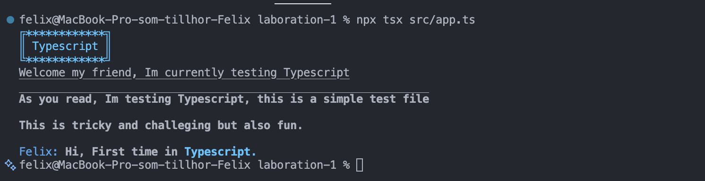

# Reflektion: Laboration 1 – Fortsätt programmera

<!--
    Komplettera filen och lämna in den tillsammans med din MR.
-->

## 1. Att fortsätta programmera

*Vilka kunskaper och färdigheter från tidigare kurser bygger du vidare på i den här uppgiften? Vad var mest utmanande? Vad vill du utveckla vidare i din programmering framöver?*

Svar: Detta tog inspiration från både java och 1dv025 kursen, speciellt då språket Typescript är helt nytt för mig. Det som var mest utmanande var att förstå grunderna och hur man skriver i Typescript, detta är fortfarande klurigt tycker jag. Det jag vill utveckla vidare är att namnge korrekt gällande variabelnamn och olika klasser samt funktioner/metoder. Att förstå hur man kan namnge något bättre är något jag ser fram emot.

## 2. Arbetsflödet

*Hur kändes det att arbeta med Git och använda kursens plattformar?*

Svar: Det kändes bra.

*Varför valde du GitLab eller GitHub för din kod? Vad vägde du in — till exempel integritet, att bygga en publik portfolio, eller vana? Om GitHub — länk till ditt repo:*

Svar: Valde både två, det medför att båda fylls på en för inlämning och den andra för att jag skall fylla github med projekt, främst är det resan för mig själv också att se hur jag förbättras gentemot 1 år sedan i olika programmeringsspråk och projekt som jag slutfört.

Github:

https://github.com/FelixJrB/First-Typescript

## 3. Bedömning och att dela publikt

*Uppgiften bedöms inte på kodens stil eller kvalitet, bara på en komplett inlämning. Påverkade det hur du arbetade? Och hur kändes det att posta din skärmdump/video publikt i Zulip, utan möjlighet att göra det privat?*

Svar: Inte nämnvärt, försökte ändå hålla mig till vad som sagts under alla kurser och de krav som tidigare funnits, både gällande ESLint och andra krav. Dock i denna uppgift är vissa delar hårdkodat vilket främst bör undivkas men då det är en introduktion och labb 1 gav mig möjligheten till att utforska ett nytt programmeringsspråk föll valet på att utforska och leka runt lite. Kändes konstigt att dela men samtidigt positivt, viktigt att man får öva på den delen, man såg hur andra hade gjort.

## 4. Ditt program

*Vilket programmeringsspråk valde du, och varför just det?*

Svar: Typescript, då det används mycket och är populärt, har sina likheter med Javascript så inte jätte annorlunda men samtidigt helt nytt.

*Vad gjorde du för att göra välkomstmeddelandet till något mer än bara `"Hej " + namn`?*

Svar: Använde mig av en constructor med parametrar än att endast skriva fram ett meddelande från return satsen, kan alltid förbättras dock.

## 5. AI-samarbete

*Samarbetade du med någon AI-assistent (t.ex. ChatGPT, GitHub Copilot, Claude) — som en kollega snarare än bara ett verktyg? Beskriv kort hur, och ge gärna ett exempel på en prompt som gav ett bra resultat.*

Svar: Claude, förklarade att jag är helt ny så vill ha byggstenar men vill skriva och lära mig allt själv, dvs den skall inte skriva koden själv. Viktigt att jag gör detta själv för att lära mig och komma in in i hur språket fungerar. Vissa delar var jag däremot tvungen att få väldigt stor hjälp för, speciellt textrutan var svår.

## 6. Bild eller video

*Bifoga (eller länka till) samma skärmdump/video som du postat i Zulip.*

Svar: https://zulip.lnu.se/#narrow/channel/19-1dv610/topic/HT26.20-.20Laboration.201.20-.20Visa.20och.20ber.C3.A4tta/near/9129

alternativ länk: 